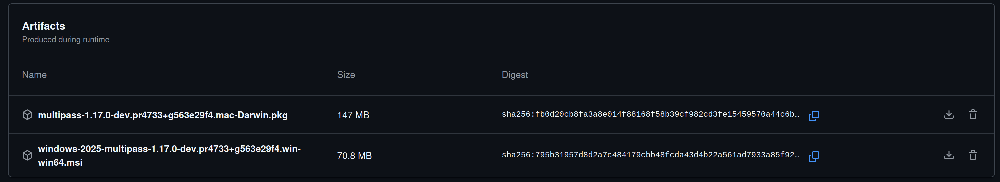

# PR artifacts and installation packages

Our CI produces packages that can be used to test PRs.

## Linux

On Linux: `snap refresh --channel edge/prXXXX`
* replace `XXXX` with the PR number
* replace `refresh` with `install` to install from scratch
* warning: if the PR channel doesn't exist for some reason, the regular edge snap will be silently installed. Use `snap info multipass` to verify.

## Windows and macOS
  1. go to the summary page for the last successful GitHub Actions run for the PR
  2. scroll to the bottom, until you see "Artifacts"
  3. Download and install the appropriate package:
    * Windows: MSI package
    * macOS: pkg package

# Easily install CI builds

To install/test CI builds, the [gh-install GitHub CLI extension](https://github.com/sharder996/gh-install) is very useful.

It downloads and installs the Multipass package built by CI for a given pull request.

Think of it as `gh co 5135`, but instead of checking out the code it installs the package produced by that PR's CI run, for your current OS. With no arguments it installs the latest nightly build.

- [https://github.com/sharder996/gh-install](https://github.com/sharder996/gh-install)
- Install with `gh extension install sharder996/gh-install`
